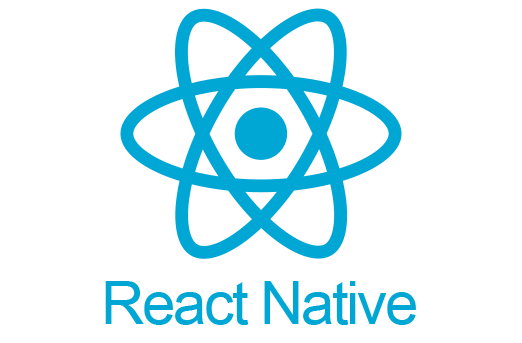

# 보유 SKILLS
## Front-end
    
## Back-end
   
## DBMS
 

---

# 🎨 포트폴리오 웹사이트
👉 **[사이트 바로가기](https://jihoo520.github.io/portfolio)**

🔗 **[코드 보러 가기](https://github.com/jihoo/portfolio)**

## 활용 기술
   

---

    

---
